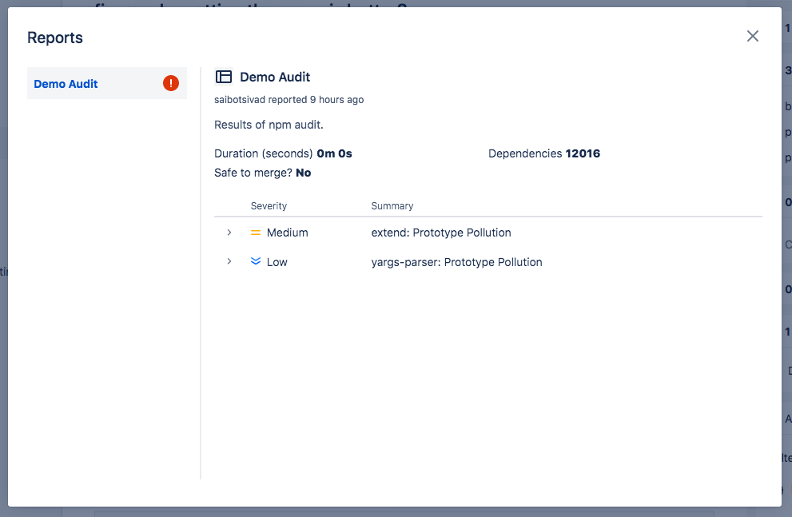

# bpr-npm-audit

Bitbucket Pipelines added [reports](https://confluence.atlassian.com/bitbucket/code-insights-994316785.html) as a feature in pull requests.

With this module, you can get the results of `npm audit` as a report, with *zero configuration*, using `npx`:

```yaml
pipelines:
  my-pipeline:
    - step:
        script:
          - npx bpr-npm-audit
```

Have a look at this [example pull request](https://bitbucket.org/saibotsivad/test-bpr-npm-audit/pull-requests/1/fix-maybe-setting-the-proxy-is-better), which generates a report like this:



## Security

This module has zero dependencies (outside of NodeJS), and is simple enough to audit yourself.

If you are very paranoid, I recommend forking this repository, auditing the forked code, and then using `npx` pointed to your fork:

```yaml
pipelines:
  my-pipeline:
    - step:
        script:
          - npx username/bpr-npm-audit
```

(Where `username` is your Github username.)

## Configure

Parameters are passed in as environment variables. For example:

```yaml
pipelines:
  my-pipeline:
    - step:
        script:
          - BPR_NAME="My Report" BPR_ID="myid" BPR_LEVEL="low" BPR_MAX_BUFFER_SIZE="20971520" npx bpr-npm-audit
```

### Authentication
Configure by setting the environment variable `BITBUCKET_AUTH`.
The content will be sent as Authorization header withing the requests.

### Report Name

Configure by setting the environment variable `BPR_NAME`.

Default: `Security: npm audit`

### Report ID

Configure by setting the environment variable `BPR_ID`.

Default: `npmaudit`

### Fail Condition

Configure by setting the environment variable `BPR_LEVEL` to one of these options:

* `low`
* `moderate`
* `high` (the default)
* `critical`

If there are any vulnerabilities at that level or higher, the report will be marked as failed.

### Reporting Level

Configure by setting the environment `BPR_LOG` to any of the `BPR_LEVEL` values.

If this is not set, all audit log entries will be included in the Pipeline Report.

Setting this property will limit the Report to contain only audit log entries at this level or higher.

### Max Buffer Size

Configure by setting the environment variable `BPR_MAX_BUFFER_SIZE` to desired value in bytes.

Default: `10485760` (10 MB)

The value shouldn't be changed unless you run into problems with `npm audit` output being too large to handle
(usually signalled by `Unexpected end of JSON input` error).

## License

This project is published and released under the [Very Open License](http://veryopenlicense.com).

---

(Made with ❤️ by [Tobias Davis](https://davistobias.com).)
